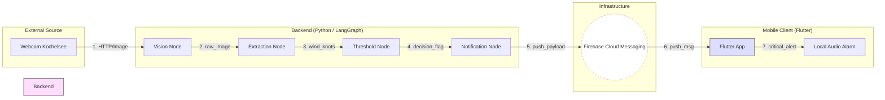

# 🌬️ Wind Alarm Agent

**Enterprise-Ready Wind Monitoring & Notification System.**

An AI-driven automation project for windsurfers and sailors that monitors un-API'd webcams at Kochelsee, extracts wind data using computer vision (OCR), and triggers loud alerts via Firebase Cloud Messaging.

---

## 🏗️ Architecture

The system follows an **Agentic / Graph-based Architecture** using LangGraph for orchestration. This approach allows for a modular, testable, and observable pipeline.



1.  **Vision Node**: Uses **Playwright** to interact with the [Addicted Sports Webcam](https://www.addicted-sports.com/webcam/kochelsee/trimini/) and capture screenshots.
2.  **Extraction Node**: Employs **EasyOCR** to parse wind speed and gusts from the visual webcam overlays.
3.  **Threshold Node**: Evaluates data freshness and checks if wind strength exceeds the configured threshold.
4.  **Notification Node**: Triggers a notification via **Firebase Admin SDK** if rules are met.
5.  **Mobile App**: **Flutter** application that receives the push and schedules high-priority local notifications.

---

## 🚀 Key Features

-   **Intelligent Extraction**: OCR bypasses lack of public weather APIs.
-   **Silent Push Workflow**: Battery-efficient background sync with the mobile device.
-   **Scalable Messaging**: Uses FCM Topics for multi-device delivery.
-   **Modular Design**: Easily adaptable to other webcams or sensors.

---

## 📋 Prerequisites

-   **Python 3.10+**
-   **Flutter SDK**
-   **Firebase Project**: `serviceAccountKey.json` from the Firebase Console (placed in root).
-   **Mobile App Configuration**: Register Android/iOS app in Firebase.

---

## 🛠️ Setup & Run

### Backend (Python)
```bash
# Setup venv
python -m venv venv
source venv/bin/activate
pip install -r requirements.txt
playwright install chromium

# Run Agent
python app.py --threshold 15.0 --url "..."
```

### Frontend (Flutter)
```bash
cd app
flutter pub get
flutter run
```

---

## 💡 Developer & Interview Notes

*This project was built with a Focus on Cloud Native Principles and Observability. For discussion on scalability (Serverless, BigQuery integration) and reliability patterns (Retry/CircuitBreaker), please see the [Architecture Overview](artifacts/architecture_overview.md).*
