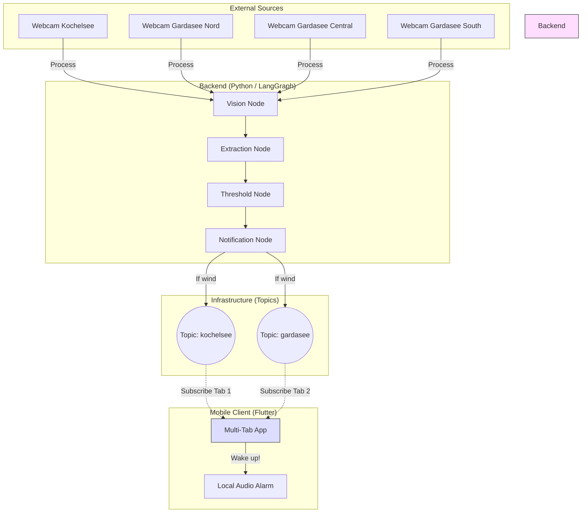

# 🌬️ Wind Alarm Agent

**Enterprise-Ready Multi-Location Wind Monitoring & Notification System.**

An AI-driven automation project for windsurfers and sailors that monitors un-API'd webcams at **Kochelsee** and **Gardasee**, extracts wind data using computer vision (OCR), and triggers loud alerts via Firebase Cloud Messaging.

---

## 🏗️ Architecture

The system follows an **Agentic / Graph-based Architecture** using LangGraph for orchestration. It now supports multiple monitoring locations.



1.  **Vision Node**: Uses **Playwright** to capture screenshots from specific locations.
2.  **Extraction Node**: Employs **EasyOCR** to parse wind values.
3.  **Threshold Node**: Checks if wind exceeds location-specific thresholds.
4.  **Notification Node**: Sends push messages to specific FCM topics (`wind_alarms_kochelsee`, `wind_alarms_gardasee`).
5.  **Mobile App**: Modern Flutter UI with bottom navigation to switch between monitoring zones.

---

## 🚀 Recent Update: Gardasee Integration

-   **Multi-Webcam Logic**: Monitoring 3 points at Lake Garda (Malcesine Nord, Malcesine, Campione).
-   **Dynamic Topics**: Automatic FCM topic switching based on the active tab in the app.
-   **New Design System**: Teal & Sand color palette for the Gardasee monitoring view.
-   **Modular Backend**: CLI flag `--location` to switch monitoring context.

---

## 📋 Prerequisites

-   **Python 3.10+**
-   **Flutter SDK**
-   **Firebase Project**: `serviceAccountKey.json` from the Firebase Console (placed in root).

---

## 🛠️ Setup & Run

### Backend (Python)
```bash
# Run for Kochelsee
python app.py --location kochelsee

# Run for Gardasee (monitoring 3 webcams)
python app.py --location gardasee
```

### Frontend (Flutter)
```bash
cd app
flutter run
```
