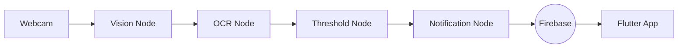

# 🌬️ Wind Alarm Agent

**Enterprise-Ready Wind Monitoring & Notification System.**

This project monitors the Kochelsee webcam, extracts wind data using OCR, and triggers Firebase notifications for windsurfers.

## 🏗️ Architecture

The system follows a **Graph-based Architecture** using LangGraph:

1.  **Vision Node**: Uses Playwright to screenshot the webcam.
2.  **Extraction Node**: Employs EasyOCR to parse wind data.
3.  **Threshold Node**: Checks if the wind exceeds a defined limit.
4.  **Notification Node**: Sends push notifications via Firebase.
5.  **Mobile App**: Flutter app that receives notifications and schedules local alarms.

## 🚀 Key Features

-   **OCR-based**: Works without weather APIs.
-   **Silent Push**: Efficient background synchronization.
-   **Multi-device**: Uses FCM Topics.

## 📋 Deployment

For deployment details, check the [README.md](../README.md).
